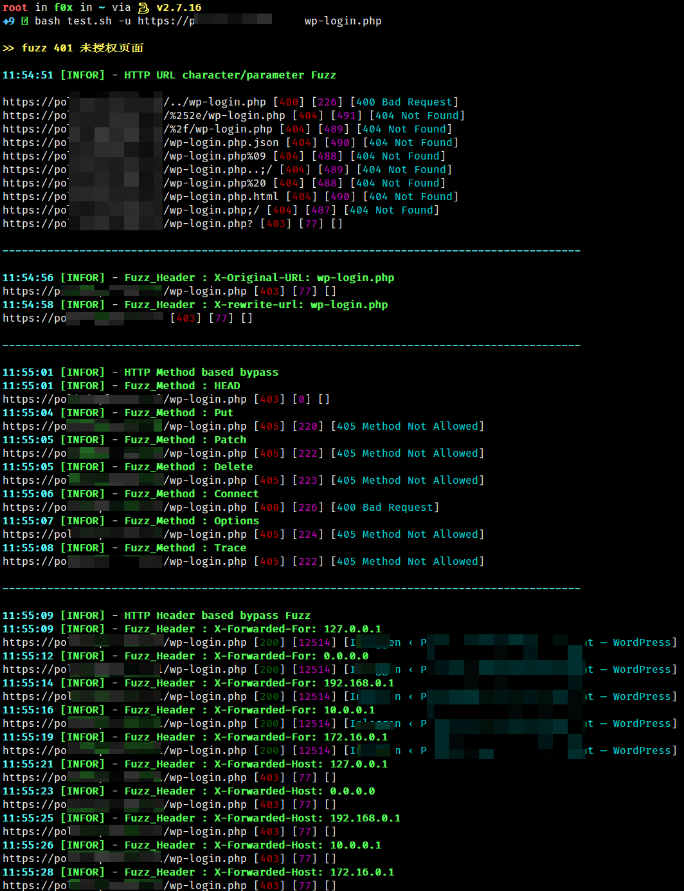

# 403-fuzz

针对 403 页面的 fuzz 脚本

---

## 开始

**1. 下载**
```bash
wget -O 403fuzz https://f8x.io/403fuzz && mv --force 403fuzz /usr/local/bin/403fuzz && chmod +x /usr/local/bin/403fuzz
```

**2. 安装 httpx**
```
go install -v github.com/projectdiscovery/httpx/cmd/httpx@latest
```

**3. 使用**

```bash
403fuzz -u http://testphp.vulnweb.com admin
```

**效果**



---

## 参考项目
- https://github.com/iamj0ker/bypass-403
- https://github.com/Dheerajmadhukar/4-ZERO-3
- https://github.com/devploit/dontgo403

---

## License

[Apache License 2.0](https://github.com/ffffffff0x/403-fuzz/blob/main/LICENSE)

---

> create by ffffffff0x
